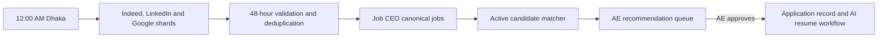

# TalentOS Production Stabilization and Candidate Job-Matching Plan

## Summary

The live recheck of [TalentOS](https://talent.skarion.com/) confirms:

- The custom domain and `/api/health` are working.
- Candidate and staff Google login start endpoints both return HTTP 500.
- `TALENTOS_BASE_URL` correctly resolves candidate callbacks to the new domain.
- The staff callback can still redirect to invalid `http://n` because it trusts the Worker request origin.
- Production likely lacks a usable `GOOGLE_CLIENT_ID`; deployment does not reliably synchronize Google credentials.
- MFA backend exists, but recovery codes cannot be entered through the current six-digit-only login field.
- Gmail, MFA, and Google authentication lack proper integration tests.
- Base-resume code uses prompt `v1.2`, while migration `064` resets the database configuration to `v1.1`.
- Some profiles contain more than 48 active keywords.
- Candidate search profiles are not yet consumed by the Job Agent.
- Typecheck is currently blocked by a merge-conflict marker in `jobAgentService.ts`.

The implementation will preserve the global nightly Apify → Job CEO pipeline and add candidate-specific matching after canonical jobs are available.

## 1. Protect the Existing Codebase

- Preserve all current staged and untracked nightly Job Agent work; do not reset, overwrite, or mix unrelated changes.
- Resolve the merge marker in `jobAgentService.ts`, synchronize the branch with its remote commit, and establish a clean passing baseline.
- Require `typecheck`, unit tests, lint, Cloudflare build, and migration dry-run before feature work begins.
- Deliver changes as separate reviewable commits: baseline, OAuth, MFA, Gmail, keyword profiles, matcher, and production rollout.
- Add feature flags with production defaults initially disabled:
  - `CANDIDATE_GOOGLE_AUTH_ENABLED`
  - `CANDIDATE_MFA_ENABLED`
  - `CANDIDATE_GMAIL_ENABLED`
  - `BASE_RESUME_KEYWORD_AGENT_ENABLED`
  - `CANDIDATE_JOB_MATCHER_MODE=off|dry_run|ae_review`
- Take a production database backup and record current row counts before applying migrations.

## 2. Google Authentication, MFA, and Gmail

### Google OAuth

- Make `https://talent.skarion.com` the required production canonical URL through one shared URL helper.
- Remove request-origin dependency and old Workers-domain production fallbacks from authentication callbacks, services, workflows, health checks, invitations, and internal dispatchers.
- Configure the Google OAuth web client with these exact redirect URIs:
  - `https://talent.skarion.com/api/auth/google/callback`
  - `https://talent.skarion.com/api/portal/auth/google/callback`
  - `https://talent.skarion.com/api/integrations/gmail/callback`
- Keep the old Workers-domain redirects only during the rollback window, then remove them.
- Store `GOOGLE_CLIENT_ID` and `GOOGLE_CLIENT_SECRET` in GitHub and Cloudflare secrets and synchronize them during deployment.
- Require `TALENTOS_BASE_URL=https://talent.skarion.com` in production; fail deployment validation if it is missing or malformed.
- Replace unhandled configuration exceptions with a controlled HTTP 503 response and a non-sensitive error code.
- Store OAuth states server-side as hashed, expiring, single-use records. Bind each state to its flow, invite reference or next path, and consume it transactionally.
- Continue linking candidates only through an existing `google_sub` or a valid candidate invitation. Never link by email automatically.
- Keep identity scopes (`openid email profile`) separate from Gmail data scopes.
- Add an admin-only Google readiness panel showing credential presence, expected callbacks, feature-flag state, and recent OAuth failures without exposing secrets.

### MFA

- Add separate “Authenticator code” and “Recovery code” input modes.
- Permit six-digit TOTP values and normalized recovery-code formats.
- Use transactional row locking for failed-attempt increments, lockout, successful reset, and one-time recovery-code consumption.
- Prevent concurrent requests from using the same recovery code twice.
- Keep the five-attempt, fifteen-minute lockout and make remaining behavior visible without leaking account information.
- Clear both full-session and pending-MFA cookies during logout.
- Refuse MFA setup when encryption configuration is unavailable.
- Show recovery codes once, require the candidate to acknowledge storage, and never log or return them again.

### Gmail

- Add an authenticated candidate route for connecting Gmail from `/portal`; preserve the existing token-based onboarding route for compatibility.
- Route both entry points through one OAuth service.
- Require the granted token to prove `gmail.modify`; never assume requested scopes were granted.
- Preserve an existing refresh token when Google omits a new one during reconnection.
- Encrypt access and refresh tokens, consume OAuth state transactionally, and allow only one active Gmail account per candidate.
- Add connect, reconnect, pause, resume, retention, and revoke/disconnect controls.
- Revoke access at Google and clear stored credentials during disconnect.
- Initial synchronization must start at `email_consent_at`; later synchronization uses Gmail history IDs and handles expired history with a controlled resync.
- Make labels and stars idempotent.
- Suppress personal mail, alerts, newsletters, receipts, banking, travel, delivery, medical, and account-security messages before AI analysis or Gmail modification.
- Store only the minimum recruiting metadata required by the retention policy and never place tokens or email bodies in application logs.

The first real Gmail test will use one consenting candidate Gmail account. Written consent, retention settings, and the test window must be recorded first. Synthetic recruiting and personal-message cases will be sent after consent so unrelated historical mail does not need to be inspected.

## 3. Base-Resume Search Profiles

- Correct migrations `063` and `064` so repeated deployments cannot overwrite administrator-edited prompts.
- Add a guarded migration that updates only stale `v1.0`/`v1.1` configurations to the code’s `v1.2` prompt and records the change.
- Keep the authoritative limits at 30–48 active keywords.
- Reject over-limit saves before truncation. Dismissed history may exceed 48, but active terms may not.
- Do not silently delete existing over-limit profiles. Mark them `needs_review` and exclude them from automatic matching until a manager corrects and approves them.
- Add profile lifecycle fields:
  - `review_status`: `pending`, `approved`, `needs_review`, or `stale`
  - `approved_by`, `approved_at`
  - resume content hash and approved profile version
- New AI generation sets the profile to `pending`; material resume changes set it to `stale`.
- Preserve dismissed terms and manually added terms during regeneration.
- Add an explicit “Approve search profile” action. Only approved, current profiles can be consumed by automation.
- Keep run history with prompt version, model, provider, sanitized input, output, timing, status, and error.
- Move bulk generation to durable claimed jobs with bounded concurrency and retries so Cloudflare request timeouts cannot leave ambiguous states.

## 4. Candidate Job Matcher

### Placement in the workflow

- Keep the existing global A–R Apify searches unchanged for the first release.
- Run candidate matching after the nightly Job CEO run completes, with a scheduled recovery endpoint.
- Match against canonical jobs whose proven `posted_at` is within seven days. The nightly ingestion window remains 48 hours.
- Eligible inputs require an active candidate, active base resume, approved/current profile, and at least one active keyword.
- Dismissed terms are excluded from discovery and positive matching. They are review history, not automatic negative filters.
- Apply deterministic exclusions before AI scoring: stale or closed jobs, duplicates, missing descriptions, unsupported mandatory credentials, clear seniority mismatch, authorization/clearance conflict, unrelated domain, and binding additional rules.
- Score each candidate/base-resume/job combination using the existing 100-point policy:
  - 85–100: strong recommendation
  - 70–84: defensible adjacent recommendation
  - Below 70 or any hard exclusion: reject
- Search keywords remain discovery signals; actual resume evidence and job description determine qualification.
- Select exactly one winning base resume for each candidate and canonical job.
- Keep a maximum of 50 recommendations per candidate per run, target 20–50 only when quality permits, and never pad weak matches.

### AE-review-first behavior

- Initial rollout mode is `dry_run`, followed by `ae_review`.
- The scheduled matcher creates recommendation decisions only; it does not create application records automatically.
- The AE review page displays score, selected resume, matched keywords, rule results, freshness, evidence, penalties, and rejection reason.
- AE approval performs one idempotent transaction that:
  - Rechecks candidate and job eligibility.
  - Creates one application with `source_type=base_resume`.
  - Uses the exact selected `base_resume_id`.
  - Assigns the configured AE.
  - Sets `ae_stage=in_ai_pipeline`.
  - Starts `triggerAiWorkflowForApplication`.
- AE rejection records a reusable decision without modifying the candidate’s resume or personal information.
- TalentOS must never submit an external application, send an email, or mark an application as applied through this matcher.

## 5. Interfaces, Data and Dashboard Changes

Add or extend:

- `GET /api/admin/integrations/google/readiness`
- `POST /api/portal/integrations/gmail/start`
- `POST /api/portal/integrations/gmail/disconnect`
- `POST /api/candidates/[id]/job-search-profiles/[profileId]/approve`
- `POST /api/cron/active-candidate-job-match`
- `GET /api/admin/candidate-job-matches`
- `POST /api/admin/candidate-job-matches/[id]/approve`
- `POST /api/admin/candidate-job-matches/[id]/reject`

Create durable data structures for:

- Single-use authentication OAuth states.
- Profile approval/version history.
- Candidate match runs and immutable match decisions.
- Recommendation review status and AE decision history.
- An application automation idempotency key that does not restrict manual applications.

Extend TalentOS UI with:

- Google integration readiness in the Admin/Control Center.
- Candidate MFA and Gmail privacy controls.
- Search-profile generation, correction, approval, and stale-state warnings.
- Candidate match run status and AE recommendation review.
- Links from approved recommendations to the resulting application and AI workflow.

## 6. Testing and Production Rollout

### Automated tests

- Google configuration missing, canonical redirect construction, callback error handling, state expiry/replay, invite binding, and candidate-linking rules.
- Password and Google login with and without MFA.
- TOTP success/failure, concurrent lockout attempts, recovery-code reuse prevention, expired pending sessions, and logout.
- Mocked Gmail token exchange, refresh-token preservation, granted-scope verification, history recovery, pause/resume, labels, stars, retention, reconnect, revocation, and personal-email suppression.
- Prompt `v1.2`, 30/48 boundaries, over-limit rejection, dismissed/manual preservation, approval/stale lifecycle, and concurrent generation claims.
- Matcher eligibility, seven-day boundaries, hard exclusions, additional rules, deterministic resume selection, scoring thresholds, duplicate protection, concurrency, partial failures, and AE approval idempotency.
- Regression tests for nightly Job Agent, Job CEO, application workflows, portal authentication, invitations, and extension APIs.

### Rollout order

1. Restore a clean passing baseline and finish the existing nightly Job Agent integration.
2. Deploy canonical-domain and Google configuration fixes with Google login disabled.
3. Verify readiness, then enable staff and candidate Google login for test accounts.
4. Deploy and verify MFA.
5. Deploy Gmail changes with synchronization paused.
6. Complete the consenting candidate Gmail test, then enable controlled synchronization.
7. Deploy prompt/profile migrations, remediate over-limit profiles, and approve a pilot cohort.
8. Run the matcher in `dry_run`, compare decisions with AE judgment, then enable `ae_review`.
9. Expand candidate cohorts only after accuracy, privacy, duplication, and workflow metrics pass.
10. Retain feature-flag rollback and the previous Worker deployment until production sign-off.

### Final acceptance

- Both Google buttons redirect to Google without HTTP 500 and return to the correct custom-domain callback.
- Staff callbacks never generate `http://n` or the old Workers domain.
- Password login, Google login, MFA, recovery codes, lockout, and logout pass end to end.
- The consenting Gmail account proves `gmail.modify`, synchronization, suppression, labels, stars, pause/resume, retention, reconnect, and revoke behavior.
- Control Center and new runs consistently report prompt `v1.2`.
- No approved profile contains more than 48 active keywords.
- Approved keywords and additional rules produce explainable candidate recommendations.
- Dismissed terms do not return or influence positive matching.
- AE approval creates exactly one application and starts the workflow with the selected base resume.
- No automatic external submission or email occurs.
- Typecheck, tests, lint, Cloudflare build, migrations, and production smoke tests all pass.

## Markdown Deliverable

Create one source-of-truth file during implementation:

`C:\Shohan\Skarion\TalentOS\docs\TALENTOS_IMPLEMENTATION_AND_PRODUCTION_VALIDATION_PLAN.md`

It will contain the verified live baseline, environment matrix, implementation phases, API and schema contracts, migration checklist, test cases, real-Gmail pilot procedure, deployment/rollback instructions, verification evidence table, and final sign-off checklist. Existing handovers and integration documentation will link to this master file and receive only required custom-domain corrections.

## Assumptions

- `https://talent.skarion.com` is the permanent production canonical domain.
- One existing Google OAuth web client will support the three exact callbacks.
- The Gmail pilot candidate provides explicit consent.
- Candidate matching launches in AE-review mode, not automatic application creation.
- The existing nightly Apify/Job CEO architecture remains authoritative for global discovery.
- The Chrome extension repository is not currently available; its production base URL and CORS regression test are required once that repository is provided.
